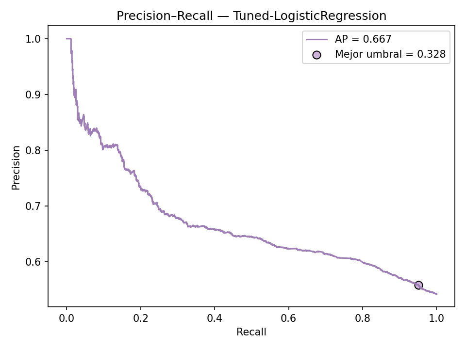

# Predicción de situaciones de trata de personas (2020–2024)

> **Proyecto de Aprendizaje Automático** · Tecnicatura en Ciencia de Datos e IA  
> **Autora:** Ana María Fernández · **Ámbito:** Oficina de Rescate y Acompañamiento (AR)  
> **Enfoque territorial:** Tierra del Fuego (transferencia del modelo)

---

## 1) Objetivo
**Clasificar** si una intervención de la Oficina de Rescate (ene-2020 a oct-2024) corresponde a **trata (1)** o **no trata (0)**.

- **Objetivo general:** construir un clasificador binario robusto y transferible a contextos de baja frecuencia (Tierra del Fuego).
- **Objetivos específicos:**
  1. EDA y preparación (valores faltantes, balance, patrones regionales).  
  2. Entrenar y comparar modelos supervisados priorizando **recall**.  
  3. **Transferencia local (TDF):** evaluar el mejor modelo nacional sobre el subconjunto local (**n** pequeño) y ajustar umbral si es necesario.

> **Informes (PDF):**  
> - 1.ª entrega → [reports/INFORME_1_ENTREGA.pdf](reports/INFORME_1_ENTREGA.pdf)  
> - 2.ª entrega → [reports/INFORME_2_ENTREGA.pdf](reports/INFORME_2_ENTREGA.pdf)  
> - 3.ª entrega → [reports/INFORME_3_ENTREGA.pdf](reports/INFORME_3_ENTREGA.pdf)

---

## 2) Datos
- **Fuente:** `oficina-rescate-orientaciones-202001-202308.csv` (2020–2024).
- **Registros (forma final):** **7.848** filas · **26** variables.  
- **Balance:** `es_trata = 1` **54%** (4.241) / `0` **46%** (3.607).  
- **Target:** `es_trata` (1/0).
- **Principales transformaciones:** normalización de strings (lowercase/sin tildes), estandarización de provincia/localidad/nacionalidad, derivación temporal (año/mes/trimestre + sin/cos), banderas (`es_fin_semana`, `es_anonima`), uso de IDs geográficos cuando están disponibles.
- **Calidad de datos:** tablas de nulos antes/después en `results/nulos_antes.csv` y `results/nulos_despues.csv`.

### 2.1) EDA (extracto)
- **Distribución del target:** `es_trata=1` ≈54% (clase positiva mayoritaria); no se requiere re-balanceo duro para el baseline.
- **Temporalidad:** picos hacia 2024; leve estacionalidad. Útil derivar `mes`, `trimestre` y componentes cíclicas (sin/cos).
- **Territorio y nacionalidad:** alta concentración en algunas provincias/localidades y pocas nacionalidades (efecto “top-K”).

**Exploración (resumen)**

**Serie mensual — total (legible)**  


**Top provincias por intervenciones**  


**Top localidades por tasa**  


---

## 3) Metodología
- **Validación:** split **temporal** (train/valid/test por fechas) sin fuga; **backtesting rolling-origin** mensual (2020-07 → 2024-12).  
- **Optimización de umbral:** por **curva Precision–Recall**, con restricción **recall ≥ 0,80**.  
- **Calibración de probabilidades:** isotónica / Platt; evaluación por **Brier score** y **curva de calibración**.  
- **Modelos evaluados:**
  - Logistic Regression (baseline)  
  - Logistic Regression + interacciones (temporada × anonimato, provincia × anonimato, nacionalidad × temporada)  
  - HistGradientBoosting (con y sin calibración)  
- **Reproducibilidad:** pipelines y umbrales persistidos; semillas fijas.
- **Hiperparámetros:** búsqueda (grid/bayes) con validación temporal; mejores combinaciones y métricas intermedias en `results/hp_search_resumen.csv` y `results/hp_best_holdout_metrics.csv`.

### 3.1) Conclusiones clave del EDA
- La actividad se concentra temporalmente con un aumento hacia 2024; justifica validación **temporal** y backtesting.  
- Fuerte concentración territorial: conviene monitorear métricas por **provincia/localidad** y considerar calibración/umbral por subgrupo.  
- El target positivo es mayoritario (~54%); **recall** alto es prioritario por criterios operativos (detección temprana).

### 3.2) Modelado y tuning
- **Pipeline final:** `prep` (num + categ + cíclicas) → `LogisticRegression` con **interacciones** (temporada×anonimato, provincia×anonimato, nacionalidad×temporada).  
- **Umbral operativo:** elegido por **PR** para **recall ≥ 0,80** sobre TEST.  
- **Calibración:** comparación sin calibrar vs calibrado; mejora en **Brier** y **curva de confiabilidad**.  
- **Tuning:** búsqueda de hiperparámetros; resultados intermedios en `results/hp_*`.

---

## 4) Resultados (resumen)
- **Modelo seleccionado (operativo):** **Logistic Regression + interacciones** con **umbral = 0,345** (PR con recall ≥ 0,80).  
  **Test:** **Precision 0,563 · Recall 0,972 · F1 0,713 · ROC-AUC 0,623**.
- **Alternativa si se prioriza F1/ROC:** **HistGradientBoosting calibrado** con **umbral = 0,396**.  
  **Test:** **Precision 0,562 · Recall 0,958 · F1 0,708 · ROC-AUC 0,659 · AP 0,685**  
  (Brier **0,243 → 0,234** tras calibración).  
- **Modelo base (referencia):** **Tuned-LogisticRegression @ thr = 0,328**.  
  **Test:** **Precision 0,559 · Recall 0,951 · F1 0,704 · AP 0,667 · ROC-AUC 0,628**.  
- **Backtesting temporal (promedios):** **Precision 0,647 · Recall 0,686 · F1 0,651**.

### 4.1) Métricas en Test (tabla)
| Modelo                                   | Umbral | Precision | Recall |   F1  | ROC-AUC | PR-AUC | Brier  |
|------------------------------------------|:-----:|:--------:|:-----:|:-----:|:------:|:------:|:------:|
| Logistic Regression + interacciones (OP) | 0,345 |  0,563   | 0,972 | 0,713 |  0,623 |   —    |   —    |
| HistGradientBoosting calibrado (ALT)     | 0,396 |  0,562   | 0,958 | 0,708 |  0,659 | 0,685  | 0,234* |

<sub>\* Brier mejora **0,243 → 0,234** tras calibración.</sub>

### Archivos clave exportados
- **Métricas / tablas**
  - [`results/modelos_metricas.csv`](results/modelos_metricas.csv)
  - [`results/hp_search_resumen.csv`](results/hp_search_resumen.csv)
  - [`results/hp_best_holdout_metrics.csv`](results/hp_best_holdout_metrics.csv)
  - [`results/best_metrics_Tuned-LogisticRegression_c16.csv`](results/best_metrics_Tuned-LogisticRegression_c16.csv)
  - [`results/best_threshold_Tuned-LogisticRegression_c16.json`](results/best_threshold_Tuned-LogisticRegression_c16.json)
  - [`results/classification_report_Tuned-LogisticRegression_opt_c16.txt`](results/classification_report_Tuned-LogisticRegression_opt_c16.txt)

- **Figuras:** se visualizan en la sección [Resultados](#resultados) y también pueden descargarse desde la carpeta [`figs/`](figs/).

<a id="resultados"></a>
### Resultados (vista rápida con imágenes)

**Curva Precision–Recall + umbral operativo**  


**Matrices de confusión**  
- **Umbral 0,50** (baseline)  
  

- **Umbral óptimo** (seleccionado por PR con foco en recall)  
  

**Calibración (reliability)**  


> El detalle completo de métricas (Recall, F1, ROC-AUC, PR-AUC), backtesting temporal y transferencia a TDF está en la **notebook** y en `results/`.

---

## 5) Transferencia a Tierra del Fuego
- Evaluación del mejor clasificador nacional sobre **TDF** (muestra chica).  
- Con **LogReg + interacciones** y **mismo umbral (0,345)** en corrida específica (**n = 30**, **positivos = 22**):  
  **Precision 0,733 · Recall 1,00 · F1 0,846**.  
  *Cautela por bajo N; monitoreo mensual y recalibración si cambia la casuística.*

---

## 6) Conclusiones finales
- **Objetivo cumplido:** el modelo logra **detección temprana** priorizando **Recall** con un **umbral optimizado por PR**.  
- **Modelo operativo elegido:** *Logistic Regression + interacciones* — balancea interpretabilidad y rendimiento; mantiene **Recall** alto con F1 competitivo.  
- **Confiabilidad:** la **calibración** mejora la lectura de probabilidades (Brier ↓ y curva de confiabilidad más cercana a la diagonal), útil para decisiones operativas.  
- **Robustez temporal:** el backtesting muestra desempeño estable con variaciones esperables por estacionalidad y tamaño muestral.  
- **Transferencia TDF:** métricas altas con **cautela por bajo N**; se recomienda seguimiento específico.

## 7) Próximos pasos
1. **Monitoreo mensual** (por provincia): Recall, PR-AUC y **Brier**; gatillar **recalibración** si |ΔBrier| > 0,03 o cae Recall > 5 pp.  
2. **Calibración por región** y/o **umbral por subgrupo** (si hay diferencias sistemáticas por territorio o época).  
3. **Enriquecer variables**: señal temporal fina (festivos, temporada), contexto territorial y **texto** (si hay descripciones).  
4. **Drift**: tablerito simple con alarmas (cambio de distribución/label rate).  
5. **MLOps mínimo**: guardar pipeline y umbral versionados; script de inferencia y checklist de validación previa a despliegue.

---

## 8) Cómo reproducir

```bash
python -m pip install -r requirements.txt
jupyter nbconvert --to notebook --execute notebooks/03_modelado_resultados.ipynb --output notebooks/03_modelado_resultados_run.ipynb
```

- Figuras: `figs/`  
- Resultados (CSV/JSON/TXT): `results/`  
- Modelo final: `models/mejor_pipeline_calibrado.pkl` *(si la notebook lo guarda)*  
- Umbral: `results/threshold_opt.json`  
- Informe: `reports/INFORME_Proyecto_Trata.pdf`

> **Notebooks entregadas:** todos los análisis/modelado están en archivos `.ipynb` dentro de `notebooks/` (Python, scikit-learn).

---

## 9) Estructura del repositorio (Cookiecutter DS — adaptado)

Este repo sigue la convención CCDS con nombres adaptados a la cursada:

```
data/
  raw/         # datos crudos (CSV original)
  curated/     # datos curados/canónicos (equivale a processed/)
notebooks/     # análisis y modelado (ipynb)
figs/          # figuras exportadas (equivale a reports/figures)
results/       # métricas/tablas/umbrales (CSV/JSON/TXT)
reports/       # informes PDF (Entrega 1, 2, 3)
models/        # artefactos del modelo (p.ej., .pkl calibrado)
utils/         # utilidades y helpers (equivale a src/)
README.md
requirements.txt
```

> Nota: estructura basada en **Cookiecutter Data Science (adaptada)**.

---

## 10) Consideraciones éticas y privacidad
- Anonimización estricta; no publicar PII. Uso educativo con orientación a mejora operativa.

---

## 11) Entorno
- Python 3.10  
- `requirements.txt`: pandas ≥ 2.2 · numpy ≥ 1.26 · scikit-learn ≥ 1.4 · matplotlib ≥ 3.8 · scipy ≥ 1.12 · joblib ≥ 1.4

---

## 12) Citas y marco de clase
- Clase 4: Regresión lineal/logística · Clase 5: KNN/Árboles · Clase 6: SVM/SGD · Clase 8: Clustering.  
  Material y prácticas de la Tecnicatura.

---

## 13) Video — Entrega 3
Duración: **5–7 minutos**. Link: **(agregar URL)**.

---

## 14) Bitácora del proceso del proyecto
Este proyecto no nació “ordenado”: errores de rutas y carpetas llevaron a crear `figs/` y `results/`, usar rutas relativas y versionar salidas.  
En modelado, todo quedó dentro de **Pipeline**, se priorizó **recall** y se ajustó el **umbral** por **PR** (aceptando más FP para detección temprana).  
En GitHub aparecieron *mixed line endings*, PDFs tratados como texto y figuras que se ven solo en **github.dev**; mientras se estabiliza, los **PDF/figuras** se respaldan en `reports/`.  
Cada tropiezo dejó una mejora: carpetas prolijas, `.gitattributes`, umbral justificado y resultados reproducibles.

---

