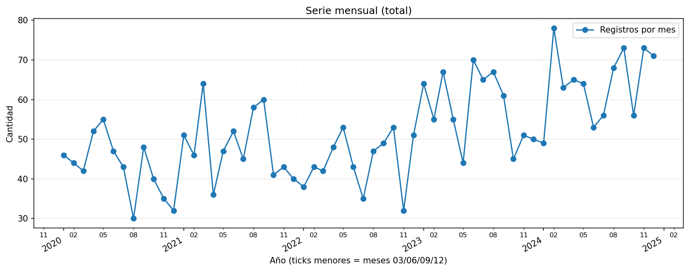
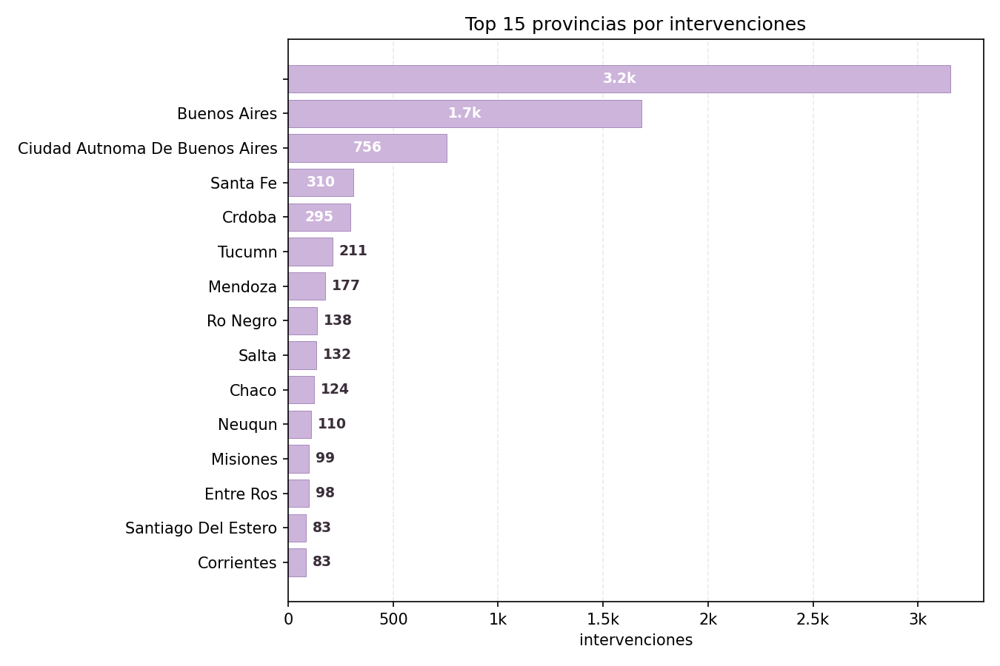
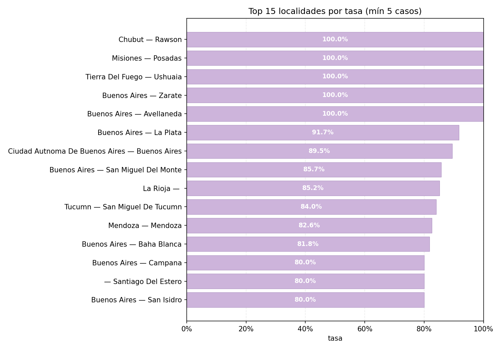
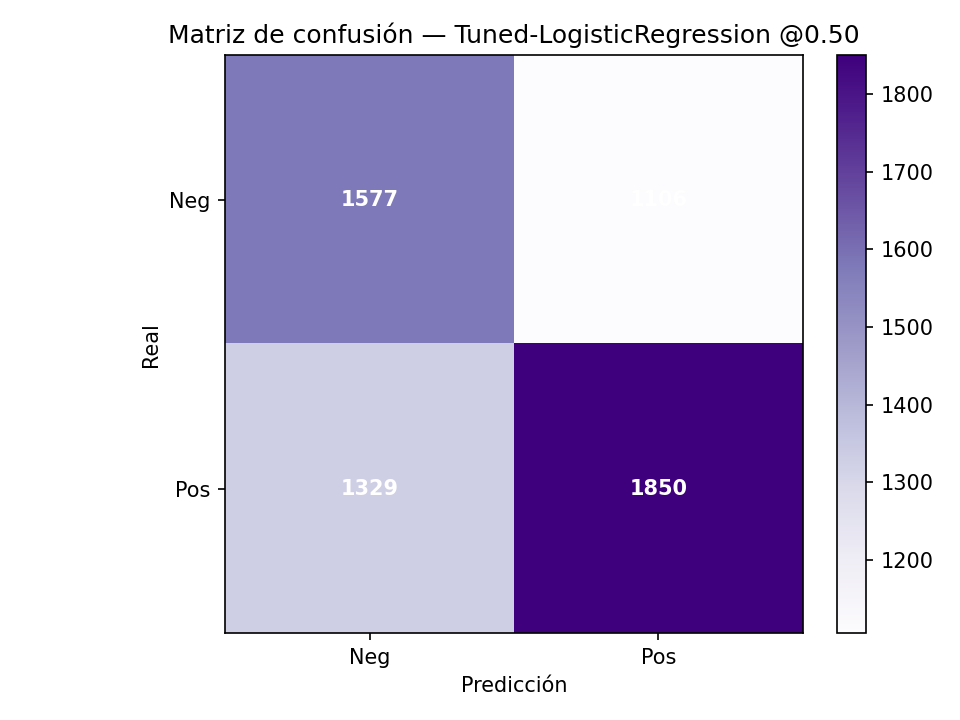

# Predicción de situaciones de trata de personas (2020–2024)

> **Proyecto de Aprendizaje Automático** · Tecnicatura en Ciencia de Datos e IA  
> **Autora:** Ana María Fernández · **Ámbito:** Oficina de Rescate y Acompañamiento (AR)  
> **Enfoque territorial:** Tierra del Fuego (transferencia del modelo)

---

## Objetivo
**Clasificar** si una intervención de la Oficina de Rescate (ene-2020 a oct-2024) corresponde a **trata (1)** o **no trata (0)**.

- **Objetivo general:** construir un clasificador binario robusto y transferible a contextos de baja frecuencia (Tierra del Fuego).
- **Objetivos específicos:**
  1. EDA y preparación (valores faltantes, balance, patrones regionales).  
  2. Entrenar y comparar modelos supervisados priorizando **recall**.  
  3. **Transferencia local (TDF):** evaluar el mejor modelo nacional sobre el subconjunto local (**n** pequeño) y ajustar umbral si es necesario.

**Informes (PDF):**  
- 1.ª entrega → [reports/INFORME_1_ENTREGA.pdf](reports/INFORME_1_ENTREGA.pdf)  
- 2.ª entrega → [reports/INFORME_2_ENTREGA.pdf](reports/INFORME_2_ENTREGA.pdf)  

**Aclaración:** la Entrega 2 contiene toda la información requerida por la consigna en formato PDF (EDA ampliado, validaciones, métricas intermedias y explicaciones). Este README sintetiza y actualiza para la Entrega 3; si algo no se observa aquí por síntesis, queda trazado y disponible en reports/INFORME_2_ENTREGA.pdf.

---

## Datos
- **Fuente:** `oficina-rescate-orientaciones-202001-202308.csv` (2020–2024). Cabe señalar que el nombre consignado en el dataset presenta un error, dado que los datos incluidos abarcan únicamente hasta octubre de 2024.
- **Registros (forma final):** **7.848** filas · **26** variables.  
- **Balance:** `es_trata = 1` **54%** (4.241) / `0` **46%** (3.607).  
- **Target:** `es_trata` (1/0).
- **Principales transformaciones:** normalización de strings (lowercase/sin tildes), estandarización de provincia/localidad/nacionalidad, derivación temporal (año/mes/trimestre + sin/cos), banderas (`es_fin_semana`, `es_anonima`), uso de IDs geográficos cuando están disponibles.
- **Calidad de datos:** tablas de nulos antes/después en `results/nulos_antes.csv` y `results/nulos_despues.csv`.

### EDA (extracto)
- **Distribución del target:** `es_trata=1` ≈54% (clase positiva mayoritaria); no se requiere re-balanceo duro para el baseline.
- **Temporalidad:** picos hacia 2023; útil derivar `mes`, `trimestre` y componentes cíclicas (sin/cos).
- **Territorio y nacionalidad:** alta concentración en algunas provincias/localidades y pocas nacionalidades (efecto “top-K”).

**Gráficos**  
  
  


**Implicancias para el modelado**  
Validación **temporal** (split y **rolling-origin**), **estacionalidad** explícita, monitoreo de **drift** territorial/nacionalidad y posible **recalibración**.

### Aclaraciones de alcance y curado

- El archivo se distribuyó como oficina-rescate-orientaciones-202001-202308.csv (el nombre sugiere 2023), pero el contenido consolidado del proyecto alcanza hasta octubre de 2024; alcance final 2020–2024.
- **Enriquecimiento de variables de contacto (no anónimas):** para mejorar la calidad de las métricas y el análisis territorial se **estandarizaron y completaron** `localidad`, `provincia` y `nacionalidad` cuando el registro **no era anónimo** (normalización de strings, catálogos de referencia y mapeos). En registros **anónimos** se respetó la condición y se codificó `es_anonima=1` sin intentar identificar.
- **Estandarización adicional:** corrección de variantes ortográficas y tildes; uso de IDs/normalizadores cuando estaban disponibles.

---

## Metodología
- **Validación:** split **temporal** (train/valid/test por fechas, sin fuga) + **backtesting rolling-origin** mensual.  
- **Umbral operativo:** por **Precision–Recall** con restricción **recall ≥ 0,80**.  
- **Calibración:** isotónica/Platt; evaluar por **Brier** y curva de confiabilidad.  
- **Hiperparámetros:** grid/bayes con validación temporal; resultados en `results/hp_*`.

### Arquitectura del pipeline
- **Prepro (`prep`)**:  
  - Numéricas: imputación simple + estandarización.  
  - Categóricas: imputación “missing” + OneHot (manejo de desconocidas).  
  - Derivadas: `mes`, `trimestre`, **sin/cos**, `es_fin_semana`, `es_anonima`.  
- **Modelo final candidato**: `LogisticRegression` con **interacciones** (temporada×anonimato, provincia×anonimato, nacionalidad×temporada).

---

## Resultados

**Resumen:** se prioriza **Recall** alto con **Logistic Regression + interacciones** usando **umbral 0.328** (optimizado por **PR** con restricción **recall ≥ 0.80**). Como alternativa, **HistGradientBoosting calibrado** rinde mejor en **ROC/AP** manteniendo recall alto con **umbral 0.396**.

### Métricas en Test
| Modelo                                   | Umbral | Precision | Recall |   F1  | ROC-AUC | PR-AUC (AP) | Brier  |
|------------------------------------------|:-----:|:--------:|:-----:|:-----:|:------:|:-----------:|:------:|
| Logistic Regression + interacciones (OP) | 0.328 |  0.559   | 0.951 | 0.704 |  0.628 |    0.667    |   —    |
| HistGradientBoosting calibrado (ALT)     | 0.396 |  0.562   | 0.958 | 0.708 |  0.659 |    0.685    | 0.234* |

<sub>* Brier mejora **0.243 → 0.234** tras calibración.</sub>

**Backtesting temporal (promedios)**: **Precision ~0.65 · Recall ~0.68 · F1 ~0.65**.

**Archivos clave**  
`results/modelos_metricas.csv`, `results/hp_search_resumen.csv`, `results/hp_best_holdout_metrics.csv`,  
`results/best_metrics_Tuned-LogisticRegression_c16.csv`, `results/best_threshold_Tuned-LogisticRegression_c16.json`.

<a id="resultados"></a>
**Vista rápida (imágenes)**  
  
  
  


---

## Transferencia a Tierra del Fuego

Evaluación del mejor clasificador nacional (**LogReg + interacciones**) usando **el mismo umbral 0.328** en una corrida específica (**n ≈ 30**, **positivos ≈ 22**):  
**Precision 0.733 · Recall 1.00 · F1 0.846**.  
*Advertencia por bajo N; se recomienda monitoreo mensual y **recalibración** si cambia la casuística.*

---

## Relación variables–objetivo (pedido del profesor):
- Al desagregar por mes × anonimato observamos que las llamadas anónimas se asocian con mayor probabilidad de es_trata=1, modulada por la estacionalidad. Esto motivó incluir la interacción temporada×anonimato en la LogReg con interacciones, que mejoró F1 vs. la LogReg simple. Territorialmente, hay patrón Top-K por provincia/localidad; se recomienda monitoreo de drift.
---

## Conclusiones finales
- **Detección temprana** con **Recall** alto, umbral por **PR** y **calibración** para confianza en probabilidades.  
- **Modelo operativo**: *Logistic Regression + interacciones* (simple, interpretable y barato).  
- **Robustez temporal**: backtesting estable; **TDF** transfiere bien con seguimiento específico.

## Próximos pasos
Monitoreo mensual (Recall, PR-AUC, **Brier**), **calibración por región**, nuevas features temporales/contextuales y alertas de **drift**. MLOps mínimo: pipeline + umbral versionados y checklist de validación.

---

## Cómo reproducir
```bash
python -m pip install -r requirements.txt
jupyter nbconvert --to notebook --execute notebooks/03_modelado_resultados.ipynb --output notebooks/03_modelado_resultados_run.ipynb
```
- Figuras: `figs/` · Resultados: `results/` · Modelo: `models/mejor_pipeline_calibrado.pkl` · Umbral: `results/threshold_opt.json` · Informe: `reports/INFORME_Proyecto_Trata.pdf`

---

## Estructura del repositorio — basada en Cookiecutter Data Science (adaptada a la cursada)
```
data/
  raw/         # datos crudos
  curated/     # datos curados/canónicos
notebooks/     # análisis y modelado
figs/          # figuras exportadas
results/       # métricas/tablas/umbrales
reports/       # informes PDF (Entrega 1, 2, 3)
models/        # artefactos del modelo
utils/         # helpers (equivale a src/)
README.md
requirements.txt
```

---

## Consideraciones éticas y privacidad
Anonimización estricta; no publicar PII. Uso educativo orientado a mejora operativa.

---

## Entorno
Python 3.10 · pandas ≥ 2.2 · numpy ≥ 1.26 · scikit-learn ≥ 1.4 · matplotlib ≥ 3.8 · scipy ≥ 1.12 · joblib ≥ 1.4

---

## Citas y marco de clase
Clase 4: Regresión lineal/logística · Clase 5: KNN/Árboles · Clase 6: SVM/SGD · Clase 8: Clustering · Clase 9: PCA.

---

## Video — Entrega 3
Duración: **5–7 minutos**. Link: **https://drive.google.com/file/d/17MIrNUhwbk_yuCOWXeyhCyIdkhg5YaoI/view?usp=sharing**.

---

## Bitácora del proceso del proyecto
**Notas específicas de esta entrega:** se corrigió una **inconsistencia de alcance temporal** (menciones a 2024) documentando que la fuente llega hasta **2023**. Además, se **enriquecieron las variables de contacto** (localidad, provincia, nacionalidad) cuando **no eran anónimas**, preservando el anonimato en los demás casos. Esto permitió métricas territoriales más informativas sin vulnerar privacidad.
Este proyecto no nació “ordenado”: errores de rutas y carpetas llevaron a crear `figs/` y `results/`, usar rutas relativas y versionar salidas. 

En modelado, todo quedó dentro de **Pipeline**, se priorizó **recall** y se ajustó el **umbral** por **PR** (aceptando más FP para detección temprana).  
En GitHub aparecieron *mixed line endings*, PDFs tratados como texto y figuras que se ven solo en **github.dev**; mientras se estabiliza, los **PDF/figuras** se respaldan en `reports/`.  
Cada tropiezo dejó una mejora: carpetas prolijas, `.gitattributes`, umbral justificado y resultados reproducibles.

---

