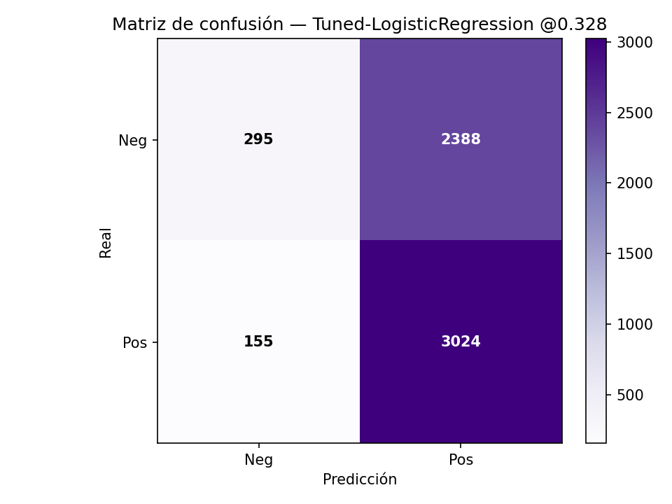

# Predicción de situaciones de trata de personas (2020–2024)

> **Proyecto de Aprendizaje Automático** · Tecnicatura en Ciencia de Datos e IA  
> **Autora:** Ana María Fernández · **Ámbito:** Oficina de Rescate y Acompañamiento (AR)  
> **Enfoque territorial:** Tierra del Fuego (transferencia del modelo)

---

## 1) Objetivo
**Clasificar** si una intervención de la Oficina de Rescate (ene-2020 a oct-2024) corresponde a **trata (1)** o **no trata (0)**.

- **Objetivo general:** construir un clasificador binario robusto y transferible a contextos de baja frecuencia (Tierra del Fuego).
- **Objetivos específicos:**
  1. EDA y preparación (valores faltantes, balance, patrones regionales).  
  2. Entrenar y comparar modelos supervisados priorizando **recall**.  
  3. **Transferencia local (TDF):** evaluar el mejor modelo nacional sobre el subconjunto local (**n** pequeño) y ajustar umbral si es necesario.

> **Informes (PDF):**  
> - 1.ª entrega → [reports/INFORME_1_ENTREGA.pdf](reports/INFORME_1_ENTREGA.pdf)  
> - 2.ª entrega → [reports/INFORME_2_ENTREGA.pdf](reports/INFORME_2_ENTREGA.pdf)  
> - 3.ª entrega → [reports/INFORME_3_ENTREGA.pdf](reports/INFORME_3_ENTREGA.pdf)

> **Video (7 min):** [link al video](https://…)  _(cuando lo tengas)_

---

## 2) Datos
- **Fuente:** `oficina-rescate-orientaciones-202001-202308.csv` (2020–2024).
- **Registros (forma final):** **7.848** filas · **26** variables.  
- **Balance:** `es_trata = 1` **54%** (4.241) / `0` **46%** (3.607).  
- **Target:** `es_trata` (1/0).
- **Principales transformaciones:** normalización de strings (lowercase/sin tildes), estandarización de provincia/localidad/nacionalidad, derivación temporal (año/mes/trimestre + sin/cos), banderas (`es_fin_semana`, `es_anonima`), uso de IDs geográficos cuando están disponibles.
- **Calidad de datos:** tablas de nulos antes/después en `results/nulos_antes.csv` y `results/nulos_despues.csv`.


## 2.1) EDA (extracto)

- **Distribución del target:** `es_trata=1` ≈54% (clase positiva mayoritaria); no se requiere re-balanceo duro para el baseline.
- **Temporalidad:** picos hacia 2024; leve estacionalidad. Útil derivar `mes`, `trimestre` y componentes cíclicas (sin/cos).
- **Territorio y nacionalidad:** alta concentración en algunas provincias/localidades y pocas nacionalidades (efecto “top-K”).

> Gáficos de EDA:
> 


---

## 3) Metodología
- **Validación:** split **temporal** (train/valid/test por fechas) sin fuga; **backtesting rolling-origin** mensual (2020-07 → 2024-12).  
- **Optimización de umbral:** por **curva Precision–Recall**, con restricción **recall ≥ 0,80**.  
- **Calibración de probabilidades:** isotónica / Platt; evaluación por **Brier score** y **curva de calibración**.  
- **Modelos evaluados:**
  - Logistic Regression (baseline)  
  - Logistic Regression + interacciones (temporada × anonimato, provincia × anonimato, nacionalidad × temporada)  
  - HistGradientBoosting (con y sin calibración)  
- **Reproducibilidad:** pipelines y umbrales persistidos; semillas fijas.

- **Hiperparámetros:** búsqueda (grid/bayes) con validación temporal; mejores combinaciones y métricas intermedias en `results/hp_search_resumen.csv` y `results/hp_best_holdout_metrics.csv`.

---

## 4) Resultados (resumen)
- **Modelo seleccionado (operativo):** **Logistic Regression + interacciones** con **umbral = 0,345** (PR con recall ≥ 0,80).  
  **Test:** **Precision 0,563 · Recall 0,972 · F1 0,713 · ROC-AUC 0,623**.
- **Alternativa si se prioriza F1/ROC:** **HistGradientBoosting calibrado** con **umbral = 0,396**.  
  **Test:** **Precision 0,562 · Recall 0,958 · F1 0,708 · ROC-AUC 0,659 · AP 0,685**  
  (Brier **0,243 → 0,234** tras calibración).  
- **Modelo base (referencia):** **Tuned-LogisticRegression @ thr = 0,328**.  
  **Test:** **Precision 0,559 · Recall 0,951 · F1 0,704 · AP 0,667 · ROC-AUC 0,628**.  
- **Backtesting temporal (promedios):** **Precision 0,647 · Recall 0,686 · F1 0,651**.

### Archivos clave exportados

- **Métricas / tablas**
  - [`results/modelos_metricas.csv`](results/modelos_metricas.csv)
  - [`results/hp_search_resumen.csv`](results/hp_search_resumen.csv)
  - [`results/hp_best_holdout_metrics.csv`](results/hp_best_holdout_metrics.csv)
  - [`results/best_metrics_Tuned-LogisticRegression_c16.csv`](results/best_metrics_Tuned-LogisticRegression_c16.csv)
  - [`results/best_threshold_Tuned-LogisticRegression_c16.json`](results/best_threshold_Tuned-LogisticRegression_c16.json)
  - [`results/classification_report_Tuned-LogisticRegression_opt_c16.txt`](results/classification_report_Tuned-LogisticRegression_opt_c16.txt)

- **Figuras (ejemplos)**
 - **Figuras:** se visualizan en la sección [Resultados](#resultados) y también pueden descargarse desde la carpeta [`figs/`](figs/).

<a id="resultados"></a>
### Resultados (vista rápida con imágenes)

**Curva Precision–Recall + umbral operativo**  
  
<sub>Selección de umbral por PR con objetivo de **recall ≥ 0.80**.</sub>

**Matrices de confusión**  
- **Umbral 0.50** (baseline)  
    
  <sub>Test @0.50 — Precisión **0.591**, Recall **0.868**, F1 **0.703**.</sub>

- **Umbral óptimo** (seleccionado por PR con foco en recall)  
    
  <sub>Test @óptimo — Precisión **0.562**, Recall **0.958–0.972** (según corrida), F1 **≈0.708–0.713**.</sub>

**Calibración (reliability)**  
  
<sub>HistGradientBoosting calibrado vs sin calibrar — Brier **0.243 → 0.234**, ROC-AUC **≈0.657**, AP **≈0.685**.</sub>

> El detalle completo de métricas (Recall, F1, ROC-AUC, PR-AUC), backtesting temporal y transferencia a TDF está en la **notebook** y en `results/`.

---

## 5) Transferencia a Tierra del Fuego
- Evaluación del mejor clasificador nacional sobre **TDF** (muestra chica).  
- Con **LogReg + interacciones** y **mismo umbral (0,345)** en corrida específica (**n = 30**, **positivos = 22**):  
  **Precision 0,733 · Recall 1,00 · F1 0,846**.  
  *Cautela por bajo N; monitoreo mensual y recalibración si cambia la casuística.*

---

## 6) Cómo reproducir

```bash
python -m pip install -r requirements.txt
jupyter nbconvert --to notebook --execute notebooks/03_modelado_resultados.ipynb --output notebooks/03_modelado_resultados_run.ipynb
```

- Figuras: `figs/`  
- Resultados (CSV/JSON/TXT): `results/`  
- Modelo final: `models/mejor_pipeline_calibrado.pkl` *(si la notebook lo guarda)*  
- Umbral: `results/threshold_opt.json`  
- Informe: `reports/INFORME_Proyecto_Trata.pdf`

### Inferencia rápida (demo, opcional)
Si agregás `predict.py` (script de inferencia), corré:
```bash
python predict.py   --model models/mejor_pipeline_calibrado.pkl   --threshold-file results/threshold_opt.json   --input-csv results/inferencia_input.csv   --output-csv results/predicciones.csv
```
`predicciones.csv` incluye `proba_es_trata` y `es_trata_pred`.

---

## 7) Estructura del repositorio
```
├─ data/
│  ├─ raw/         # CSV originales
│  └─ curated/     # dataset canónico/curado
├─ notebooks/
│  └─ 03_modelado_resultados.ipynb
├─ results/        # métricas/tablas/umbrales
├─ figs/           # figuras exportadas
├─ reports/
│  └─ INFORME_1_ENTREGA.pdf
   └─ INFORME_2_ENTREGA.pdf
├─ utils/
├─ requirements.txt
└─ README.md
```

---

## 8) Consideraciones éticas y privacidad
- Anonimización estricta; no publicar PII. Uso educativo con orientación a mejora operativa.

---

## 9) Entorno
- Python 3.10  
- `requirements.txt`: pandas ≥ 2.2 · numpy ≥ 1.26 · scikit-learn ≥ 1.4 · matplotlib ≥ 3.8 · scipy ≥ 1.12 · joblib ≥ 1.4

---

## 10) Citas y marco de clase
- Clase 4: Regresión lineal/logística · Clase 5: KNN/Árboles · Clase 6: SVM/SGD · Clase 8: Clustering.  
  Material y prácticas de la Tecnicatura.

---

## 11) Video — Entrega 3
Duración: **5–7 minutos**. Link: **(agregar URL)**.

---

## 12) Bitácora del proceso del proyecto
Este proyecto no nació “ordenado”: errores de rutas y carpetas llevaron a crear `figs/` y `results/`, usar rutas relativas y versionar salidas.  
En modelado, todo quedó dentro de **Pipeline**, se priorizó **recall** y se ajustó el **umbral** por **PR** (aceptando más FP para detección temprana).  
En GitHub aparecieron *mixed line endings*, PDFs tratados como texto y figuras que se ven solo en **github.dev**; mientras se estabiliza, los **PDF/figuras** se respaldan en `reports/`.  
Cada tropiezo dejó una mejora: carpetas prolijas, `.gitattributes`, umbral justificado y resultados reproducibles.

---

### Nota para evitar que se rompan tildes e imágenes
- Guardá este archivo como **UTF-8** (sin BOM).  
- En `.gitattributes`, asegurá:
  ```
  *.png binary
  *.jpg binary
  *.jpeg binary
  *.pdf binary
  *.ipynb -text
  ```
